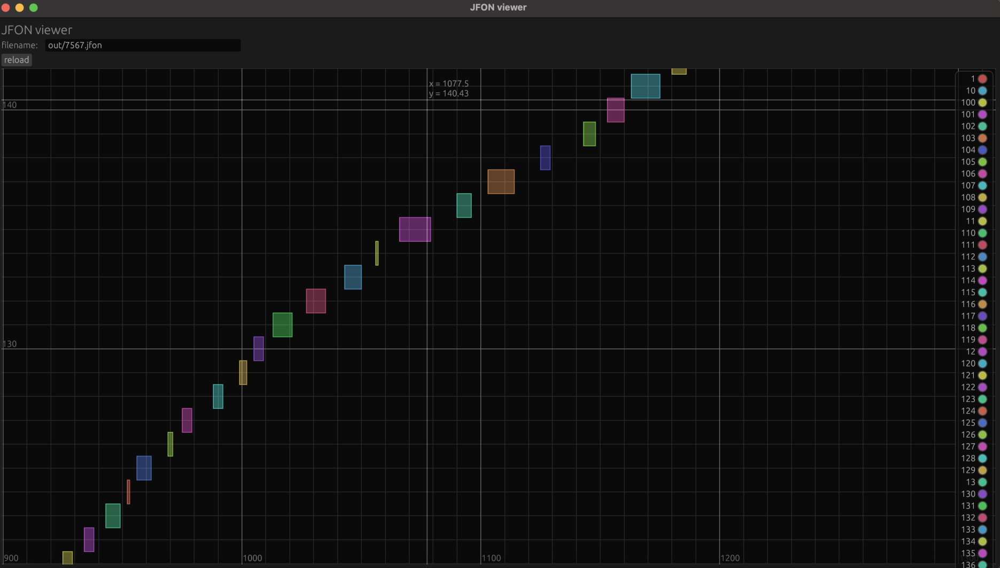
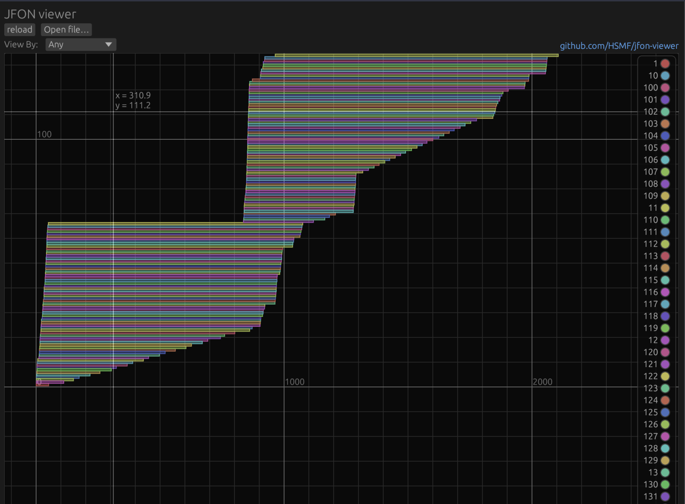

# JFON viewer

## Gallery




## Building

Make sure that Rust is installed ([follow this](https://www.rust-lang.org/tools/install)).

```fish
$ cargo run --release -- [<path/to/.jfon/file>] # run it
$ cargo install --path . # install it to PATH, this will create a command called jfon-viewer
# then
$ jfon-viewer [<path/to/.jfon/file>]
```

## Example Usage, C

In the tracee, add the following lines: (this assumes that you have a function `get_time` that returns the current time).
Feel free to modify this sample though

```c
static void  report(u32 seqno, char begins) {
    static FILE* outfile = NULL;
    // init
    if (outfile == NULL) {
        if (pid == -1) {
            pid = getpid();
        }
        char fname[64];
        snprintf(fname, 64, "out/%d.jfon", pid);
        outfile = fopen(fname, "w");
    }

    fprintf(outfile, "seqno:%d,%s,%lu\n", seqno, begins ? "start" : "end",
             get_time());
    fflush(outfile);
}
static void report_start(u32 seqno) {
    report(seqno, 1);
}
static void report_end(u32 seqno) {
    report(seqno, 0);
}
```

Then, call `report_start` when you want to start recording and `report_end` when you want to end recording.
Corresponding IDs will be bundled as a single bar.

## Name

I originally wanted to use JSON to store the timings, but unfortunately JSON is a terrible format.
